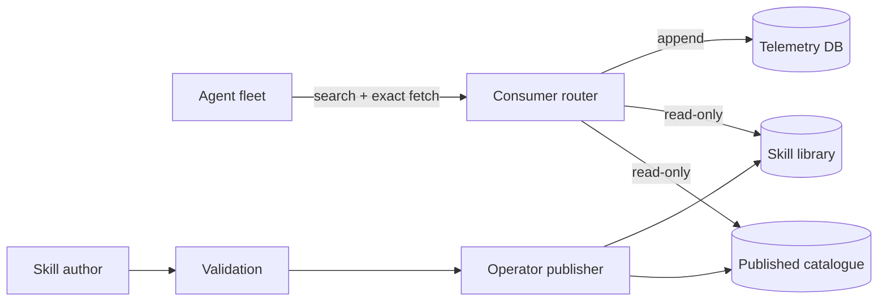

# Torafirma Skill Router

> A deterministic, content-addressed skill algebra for agentic systems.
>
> No vector databases. No model drift. Just SHA-256, SQLite, and a closed-form ranking function derived from bounded utility.


> **Automatic routing — no user interaction required:** once connected through MCP or the included interface skill, the agent searches a bounded local metadata catalogue, selects an explainable ranked candidate, exact-fetches the selected SHA-256 revision, and continues the user's original task.

Skill Router keeps one small interface skill in context and leaves the full library on disk. Version 1.1.0 formalizes the ranking function, emits replayable decision records, pins skill bodies by revision and catalogue generation, separates read-only consumers from privileged publishers, and exposes a stable C ABI.

## **Why this is different**

Three problems are resolved by one explicit contract:

1. **Version integrity:** skill bodies are identified by SHA-256 revisions and re-hashed immediately before fetch.
2. **Semantic routing without opaque inference:** exact lexical tiers, FTS5/BM25, bounded edit distance, telemetry, and lifecycle state are combined in one published equation.
3. **Catalog consensus:** one SHA-256 generation commits to the canonical publication-relevant catalog.

There is no embedding model, vector database, learned classifier, random tie-break, capability-graph distance, or hidden manual priority.

The mathematical scope is precise: immutable content-addressed revision records form a finite-union monoid; SHA-256 commits to the deterministic published projection. The hash function itself is not claimed to be the monoid operation.

Read:

- [A Monoid Over Hashes](WHITEPAPER.md)
- [Proof Sketch](PROOF_SKETCH.md)
- [Ranking and Load-Time Identity Contract](docs/RANKING_AND_IDENTITY_CONTRACT.md)
- [Stable C ABI](docs/C_ABI.md)
- [Fifteen-Minute Math Walkthrough](docs/MATH_WALKTHROUGH.md)
- [Hacker News Submission Draft](docs/HACKER_NEWS_DRAFT.md)

## What changed in 1.1.0

- Public ranking policy: `tf.skillrouter.hybrid-lexical.v1`.
- Full score decomposition in search output and append-only decision receipts.
- SHA-256 `revision_id` for exact skill-body identity.
- Deterministic `catalog_generation` for the ranked catalogue snapshot.
- Fail-closed search-to-fetch verification.
- Pin-on-fetch semantics; no implicit hot reload during an active task.
- Read-only consumer catalogue connections.
- Separate writable telemetry database.
- Operator-only registration, indexing, deprecation, and archival.
- Revision-pinned MCP tools and resources.
- Stable C ABI with explicit status and buffer ownership.
- pybind11, N-API, and Rust bindgen binding scaffolds.
- C++ contract tests and C ABI drift/fetch smoke tests.
- Linux and Windows CI.
- Signed release-manifest workflow.

The packaged 1.0.0 Windows artifact remains available while the 1.1.0 release workflow produces the new executable and C ABI library.

## One executable, four interfaces

| Interface | Intended use | Catalogue access |
|---|---|---|
| **MCP stdio** | Automatic agent routing | Consumer/read-only by default |
| **CLI** | Automation, diagnostics, search and exact fetch | Consumer by default; explicit operator commands |
| **Loopback HTTP** | Trusted local integrations | Consumer/read-only by default |
| **Interactive shell** | Human administration | Operator/read-write |

Running `skillrouter` with no arguments opens the operator shell. Running `skillrouter --help` prints scripting usage.

## Why it exists

Large agent installations can contain hundreds or thousands of specialized skills. Injecting every description and body into every prompt is expensive and noisy. Skill Router reverses that model:

1. The user gives the agent an ordinary task.
2. The agent invokes the small `skill-router` interface internally.
3. The router searches compact indexed metadata.
4. The agent receives bounded ranked candidates with score explanations.
5. The agent selects one candidate and exact-fetches its returned revision and generation.
6. Only that verified `SKILL.md` enters context.
7. Routing decisions and fetch receipts are recorded in separate telemetry storage.

## Ranking contract

The current policy is deterministic and lexical:

```text
base = exact + 0.6 * fts_norm + 0.35 * fuzzy
score = base * telemetry_multiplier * state_multiplier
```

Exact token tiers are:

```text
keywords     3.0
skill name  2.0
description 1.0
```

FTS5 uses Porter stemming and prefix matching. Fuzzy matching uses bounded Levenshtein distance only for exact-missed tokens. The historical suggestion-to-fetch multiplier is capped at `1.5`; deprecated skills receive a `0.3` multiplier; exact ties resolve by ascending `skill_id`.

Because `0.6 + 0.35 = 0.95 < 1.0`, FTS plus fuzzy evidence cannot overturn a full one-point exact-tier advantage when telemetry and lifecycle multipliers are equal.

Every returned candidate includes:

- normalized query and digest;
- ranking policy and mode;
- exact, FTS, fuzzy, telemetry, and lifecycle components;
- `skill_id` and `skill_version`;
- immutable `revision_id`;
- `catalog_generation`;
- deterministic tie-break key.

## Load-time identity

A selected skill is identified by:

```text
(skill_id, skill_version, revision_id, catalog_generation)
```

Consumer fetch requires the revision and generation returned by search. The router re-hashes the file immediately before returning it. A changed file or catalogue produces a terminal mismatch; no unverified body is returned.

Once loaded, a revision remains pinned for the current task. Publication does not silently rewrite instructions already present in an agent context.

## Consumer/publisher separation



Consumer processes open the catalogue read-only and have no MCP publication methods. Operators alone register, index, deprecate, archive, and publish. Production deployments should mirror the router boundary with filesystem ACLs or read-only mounts.

See [Integration Patterns](docs/INTEGRATION_PATTERNS.md) and the [Architecture Measurement Ledger](docs/ARCHITECTURE_MEASUREMENT_LEDGER.md).

## C ABI and bindings

The stable portability boundary is:

```text
skill-router/skilllib_c.h
skill-router/skilllib_c.cpp
```

It uses opaque handles, explicit status codes, caller-released buffers, and handle-local diagnostics. No C++ exception crosses the ABI.

Bindings:

| Language | Mechanism | Status |
|---|---|---|
| Python | pybind11 direct C++ convenience binding | Scaffolded |
| Node.js | N-API over the stable C ABI | Scaffolded |
| Rust | bindgen plus safe ownership wrapper | Scaffolded |

The bindings are deliberately separate from the canonical engine contract. Their outputs preserve the same identity tuple and score decomposition.

## Windows release

[Download Skill Router 1.0.0 for Windows x64](releases/skill-router-windows-x64-1.0.0.zip)

ZIP SHA-256:

```text
FBB8925A621A22BE13EDE6B09BAD9CA0B90DD968B71CC79AB30DF2849338865F
```

The 1.0.0 executable is unsigned and does not implement the complete 1.1.0 revision contract.

The [1.1.0 release workflow](.github/workflows/release.yml) builds Linux and Windows packages, executes the C++ and C ABI tests, computes `SHA256SUMS`, signs the manifest with a release-specific OpenPGP key, exports the public key and fingerprint, and publishes all assets.

A release-specific ephemeral key proves manifest/signature consistency but does not establish persistent publisher identity. Replace it with a protected long-term signing key when durable publisher authentication is required.

## Build 1.1.0 from source

### Windows x64

Requirements:

- Visual Studio 2022 C++ Build Tools;
- PowerShell 5.1 or later.

```powershell
cd .\skill-router
.\build_windows_msvc.bat
.\build\test_library.exe
.\build\test_c_api.exe
```

Outputs include:

```text
skillrouter.exe
build\skillrouter_c.dll
build\skillrouter_c.lib
```

### Linux or native POSIX

```bash
cd skill-router
make clean
make test
make
make capi
```

Outputs include:

```text
skillrouter
libskillrouter.a
libskillrouter.so
```

## Upgrade from 1.0.0

Version 1.0.0 used a short internal hash and permitted bare fetches. Before starting a 1.1.0 consumer against an existing catalogue:

1. stop all consumer router processes;
2. build or install the 1.1.0 binary;
3. run a complete operator index over the library;
4. retain the emitted catalogue generation;
5. start consumers with read-only catalogue access and separate telemetry storage.

```powershell
.\skillrouter.exe index .\skill_library `
  --db .\skill_index.db `
  --telemetry-db .\skill_telemetry.db `
  --role operator
```

An old catalogue that has not been re-indexed fails revision verification rather than silently returning content.

## Search and exact fetch

```powershell
$hit = (.\skillrouter.exe search "windows cpp build" `
  --db .\skill_index.db `
  --telemetry-db .\skill_telemetry.db `
  --role consumer `
  --json | ConvertFrom-Json)[0]

.\skillrouter.exe fetch $hit.skill_id `
  --revision $hit.revision_id `
  --catalog-generation $hit.catalog_generation `
  --db .\skill_index.db `
  --telemetry-db .\skill_telemetry.db `
  --role consumer
```

## MCP integration

```powershell
.\skillrouter.exe mcp `
  --db C:\absolute\skill_index.db `
  --telemetry-db C:\absolute\skill_telemetry.db `
  --role consumer
```

The MCP surface exposes:

- `skill_search`;
- `skill_fetch`;
- `skill_stats`;
- `skill_graveyard`;
- revision-pinned `skill://` resources.

`skill_fetch` requires `skill_id`, `expected_revision`, and `catalog_generation`.

## Security posture

- Skill bodies are never stored in the catalogue database.
- Consumer catalogue access is SQLite read-only with `query_only` enabled.
- Telemetry is separated from catalogue state.
- MCP contains no publication operation.
- Search-to-fetch drift fails closed.
- SQL values use prepared statements.
- Query and body sizes are bounded.
- HTTP is opt-in and loopback-only.
- Third-party skill instructions remain untrusted downstream input.
- Filesystem ACLs remain required to enforce read-only skill bodies outside the router.

## Repository layout

```text
.
|-- README.md
|-- WHITEPAPER.md
|-- PROOF_SKETCH.md
|-- bindings/
|   |-- python/
|   |-- node/
|   `-- rust/
|-- docs/
|   |-- C_ABI.md
|   |-- HACKER_NEWS_DRAFT.md
|   |-- MATH_WALKTHROUGH.md
|   |-- INTEGRATION_PATTERNS.md
|   |-- RANKING_AND_IDENTITY_CONTRACT.md
|   `-- ARCHITECTURE_MEASUREMENT_LEDGER.md
|-- .github/workflows/
|   |-- ci.yml
|   `-- release.yml
|-- releases/
`-- skill-router/
    |-- main.cpp
    |-- skill_library.hpp
    |-- skilllib_c.h
    |-- skilllib_c.cpp
    |-- test_c_api.cpp
    |-- mcp_server.hpp
    |-- test_library.cpp
    |-- INTEGRATION_MANUAL.md
    |-- build_windows_msvc.bat
    |-- package-windows.ps1
    |-- index-skills.ps1
    |-- skills/skill_router/SKILL.md
    `-- third_party/
```

## License

MIT License. Copyright (c) 2026 Thomas Helm.
