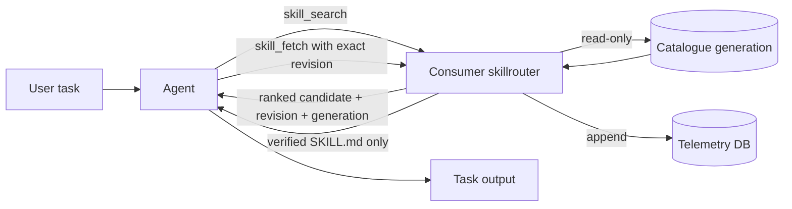
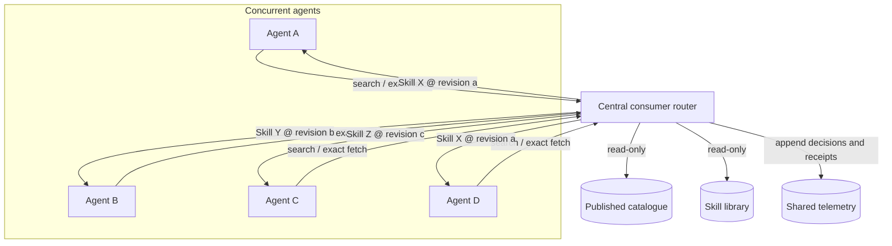
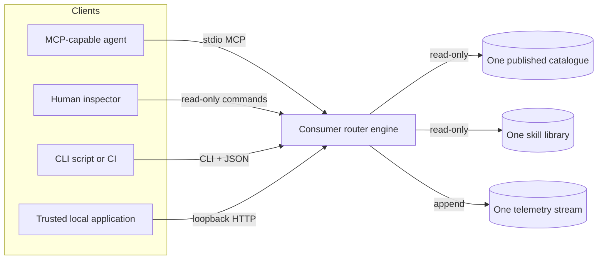
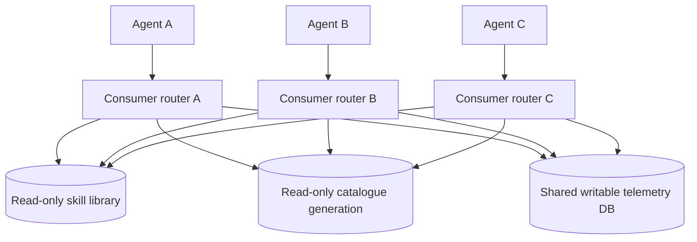
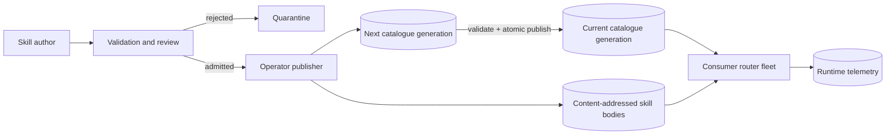
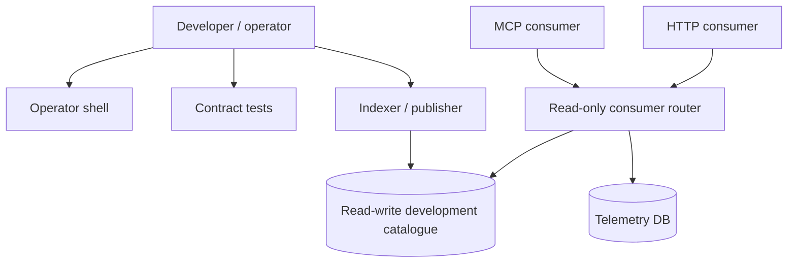

# Skill Router Integration Patterns

This document shows how `skillrouter` serves individual agents, concurrent agent fleets, human operators, scripts, and local services from one governed skill library.

The key properties are:

- skill bodies remain on disk;
- the catalogue contains compact searchable metadata and immutable SHA-256 revision identities;
- only the selected skill body is fetched;
- every routing decision is explainable and replayable against its recorded inputs;
- consumer processes open the catalogue read-only;
- runtime telemetry is written to a separate database;
- publication is an operator function, not an agent-consumer function;
- loaded skill revisions are pinned for the current task and never hot-reloaded implicitly.

The exact formula and identity semantics are defined in [Ranking and Load-Time Identity Contract](RANKING_AND_IDENTITY_CONTRACT.md). Open evidence points are tracked in [Architecture Measurement Ledger](ARCHITECTURE_MEASUREMENT_LEDGER.md).

## 1. Single-agent automatic routing



The user states the underlying task. The agent invokes the router internally, receives bounded ranked candidates, selects one, and fetches the exact revision returned by search. The user does not manually browse or choose a skill.

## 2. Centralized consumer service for multiple agents



Agents share ranking telemetry and catalogue state without sharing active prompt context. The service can serve the same immutable skill revision to several agents concurrently.

## 3. One library, multiple consumer transports



MCP, CLI, and loopback HTTP are transport projections over the same ranker and exact-fetch contract. Direct operator administration should run through a separately privileged process.

## 4. Per-agent process isolation with shared immutable catalogue



Use one consumer router per agent when process-level fault isolation matters. Each process opens the catalogue with SQLite read-only flags. The operating-system identity should also receive read-only permission over the catalogue and skill bodies; only the telemetry database is writable.

## 5. Governed publication and atomic generation turnover



Publication is separated from consumption. The operator validates skills, computes revisions, indexes the complete admitted set, and publishes a new generation. Consumers do not modify the live generation. A search made against generation `g` must fetch against `g`; a generation change produces a fail-closed mismatch and requires a fresh search.

## 6. Mixed local development



A development machine can host both roles, but they remain explicit. Operator commands open the catalogue read-write. Search, fetch, HTTP, and MCP default to consumer/read-only behaviour.

## Operational guidance

| Concern | Recommended pattern |
|---|---|
| Lowest safe integration complexity | One consumer MCP router per agent host, read-only catalogue, separate telemetry database |
| Centralized capability governance | Immutable published catalogue with a controlled operator publication path |
| Strong process isolation | Separate consumer router process per agent |
| Shared telemetry and ranking | Consumer routers append to one coordinated telemetry database |
| Human inspection | CLI or operator shell, with operator credentials only when administration is intended |
| CI and validation | Operator indexing plus deterministic contract tests and machine-readable output |
| Custom local tooling | Loopback HTTP consumer API |
| High-concurrency production | Immutable catalogue generations, OS-level read-only permissions, separate telemetry storage |

## Ranking boundary

The ranker is `tf.skillrouter.hybrid-lexical.v1`:

```text
base = exact + 0.6 * fts_norm + 0.35 * fuzzy
score = base * telemetry_multiplier * state_multiplier
```

Exact token matches remain dominant; FTS5 adds stemmed/prefix recall; bounded edit distance adds typo tolerance; historical suggestion-to-fetch conversion contributes a capped multiplier; deprecated skills receive a penalty; ties resolve by `skill_id`.

Search returns the full score decomposition and the inputs required for replay. It does not use embeddings or capability-graph distance in this policy version.

## Skill identity and temporal boundary

A search result identifies a selected body with:

```text
(skill_id, skill_version, revision_id, catalog_generation)
```

Consumer fetch must present `revision_id` and `catalog_generation`. The router recomputes the body revision before return. On mismatch it returns no body.

An agent that has already loaded a body keeps that exact copy for its current task. Catalogue publication does not silently hot-reload an in-flight context. Refresh requires a new search and exact fetch.

## Runtime enforcement boundary

Router-level enforcement includes:

- SQLite read-only catalogue connections in consumer mode;
- separate writable telemetry storage;
- no publication tools in the MCP surface;
- read-only guards on registration and lifecycle methods;
- fail-closed exact revision fetches.

Production deployments should add filesystem ACLs, container mounts, or equivalent controls so a compromised consumer process cannot bypass the router and write skill files directly.

## Conflict model

Skill Router reduces context-level conflict by loading selected revisions on demand. It does not claim to eliminate all distributed-systems conflict.

Remaining measurable surfaces include:

- telemetry write contention under unusually high concurrency;
- publication turnover while consumers hold an earlier generation;
- different agents choosing different valid candidates for ambiguous intent;
- emergency revocation of instructions already loaded into a context;
- downstream conflicts created by the skills themselves.

These are explicit system boundaries, not silent assumptions.
